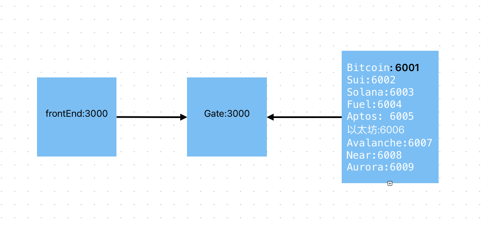

# Faucet-ATM

[What is it](#what-is-it) -
[Why build this](#why-you-want-to-build-this) -
[Contribution](#contributing) -
[Partnership](#partenshippar) - 
[简体中文版](Readme.zh-CN.md) -
[How to contribute](./how_to_contribute.md)

## What is it？
Hello everyone, welcome to Faucet-ATM! We are an open-source, community-driven test token faucet project. We aim to collaborate with the community to establish a one-stop service for obtaining test tokens together.
## Why we want to build this？
We believe that during everyone's web3 journey, there will be some awkward situations, such as a lack of specific test tokens, not knowing how to obtain addresses for certain test tokens, or encountering dry faucets that don't provide test tokens. These issues can potentially lead to a decrease in development efficiency.   

Therefore, we hope to leverage the collaborative power of the community to build a one-stop faucet project together, benefiting a larger number of people.

## Contribution
If you are a developer and interested in our project, we warmly welcome your assistance. Additionally, we will incentivize more developers to join our project by issuing tasks [contribution guide](CONTRIBUTION.md).  

If you are not a developer, that's okay too – we are still very pleased that you are following us. If you like our project, please don't hesitate to share it with friends who may encounter similar situations.

## Partenship
Thank you for the kind assistance from all project parties. We believe that your support will make the crypto world even better.

## License
Copyright (c) The Facuet-ATM Authors. All rights reserved.

Licensed under the Apache License, Version 2.0 (the "License"); you may not use this file except in compliance with the License. You may obtain a copy of the License at 

    

    <a href='https://www.apache.org/licenses/LICENSE-2.0'>Apche License 2.0</a>
    

  
Unless required by applicable law or agreed to in writing, software
distributed under the License is distributed on an "AS IS" BASIS,
WITHOUT WARRANTIES OR CONDITIONS OF ANY KIND, either express or implied.
See the License for the specific language governing permissions and
limitations under the License.
