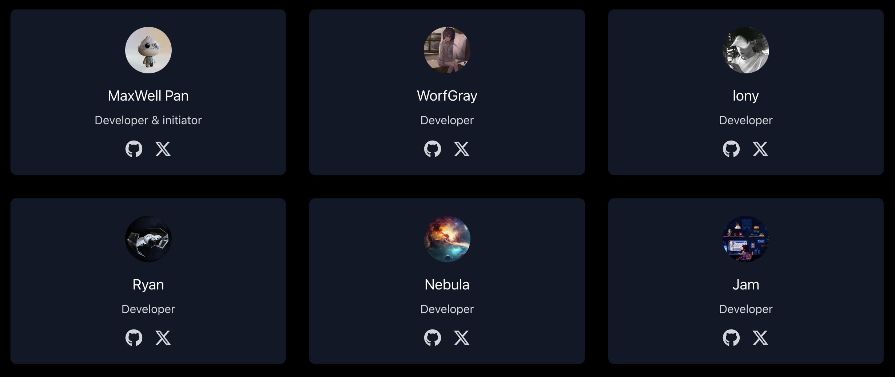
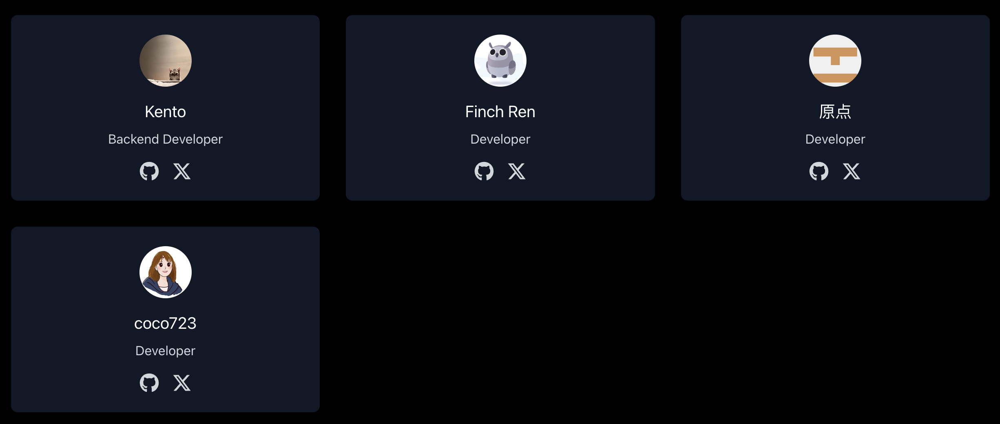

# Faucet-ATM

[项目介绍](#what-is-it) -
[为什么要构建这个项目](#why-you-want-to-build-this) -
[贡献](#contributing) -
[合作伙伴关系](#partenshippar) - 
[English](./Readme.md) - 
[如何进行贡献](./how_to_contribute.zh-CN.md)

## 项目介绍
Faucet-ATM 是由 OpenBuild 开发者社区发起的一个面向开发者的开源水龙头聚合器，我们希望降低开发者在开发中获取测试网 Token 的门槛，使他们开发体验更加顺畅。

目前已经有 **10+** 开发者参与到此项目的贡献中，已经支持 **12+** 链，且正在快速拓展中，我们预计在 **6** 月中旬正式上线一个版本。  

Faucet-ATM 测试地址：https://faucet-front-end.vercel.app   

Faucet-ATM Github： https://github.com/Faucet-ATM  

## 已支持的链

1. Fuel 
2. Aptos 
3. Sui (马上支持)
4. Mantle (马上支持)
5. Bitcoin (马上支持)
6. Solana (马上支持)
7. Sui (马上支持)
8. ETH (马上支持)
9. Near (马上支持)
10. Aurora (马上支持)
11. Chainlink (马上支持)

## Facuet-ATM 核心贡献者

## 为什么要构建这个项目？
因为我们在过往的很多课程/活动中发现开发者会因为测试网 Token 的问题而有一个很糟糕的开发体验：
目前很多项目提供的默认水龙头是面向所有用户的，而开发者对于测试 Token 的需求高于普通用户，所以默认情况下获取的测试 Token 可能不够用
通用性的反女巫策略，导致很多测试网 Token 被羊毛党获取，真实的开发者可能获取不到
搜索引擎搜索出来的很多水龙头并不可用，甚至会出现钓鱼网站情况（新手开发者无法辨别）

因此，我们希望利用社区的合作力量一起构建一个一站式水龙头项目，惠及更多的人。

## 解决方案
而 Faucet-ATM 则将具有以下特性：
面向开发者，可以针对使用场景(交易/部署等)获取不同推荐数量的测试网 Token
基于 Github 历史记录评分的反女巫策略，更好的筛选真实的开发者
基于 OpenBuild OAuth 数据可以帮助提供测试 Token 的项目获取画像精准的开发者（OAuth 需开发者授权）

## 贡献
如果你是开发人员并对我们的项目感兴趣，我们热烈欢迎你的协助。此外，我们将通过发布任务来激励更多的开发人员加入我们的项目，具体请查看 [贡献指南](ConTRIBUTION.zh-CN.md)。

如果你不是开发人员，也没关系 — 我们仍然很高兴你关注我们。如果你喜欢我们的项目，请毫不犹豫地与可能遇到类似情况的朋友分享。

## 合作伙伴关系
感谢所有项目方的友善协助。我们相信你们的支持将使加密世界变得更加美好。

## 许可证
版权所有（c）Faucet-ATM 作者。保留所有权利。

根据 Apache License, Version 2.0（“许可证”）许可；除非符合许可证的规定，否则您不得使用此文件。您可以在以下网址获取许可证的副本

    

    <a href='https://www.apache.org/licenses/LICENSE-2.0'>Apche License 2.0</a>
    

除非适用法律要求或书面同意，否则根据许可证分发的软件是基于“原样”分发的，无论是明示还是暗示的，都没有任何形式的保证或条件。请参阅许可证以获取具体的使用权限和限制。
